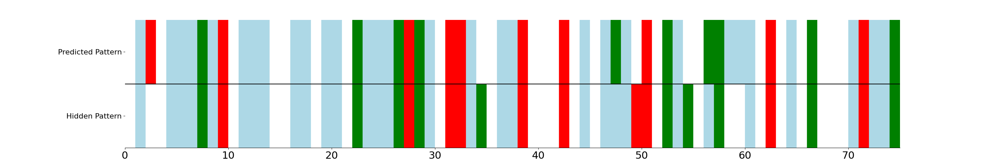

# mutation-hotspot-detection
Code to train a neural network to identify mutation "hotspots" in a protein sequence. Details on the dataset and experiments can be found in `src/experiment_driver.py`.



## To run:
1. Clone the repository
```
git clone https://gitlab.com/dellacortelab/mutation-hotspot-detection.git
```
2. Build the docker container
```
cd mutation-hotspot-detection && docker build -t mutation-hotspot -f docker/Dockerfile .
```
3. Run an interactive docker container (replacing `/path/to/data` and `/path/to/logs` with the desired local paths)
```
docker run -it --rm --name myname-hotspot -v $(pwd):/code -v /path/to/data:/data -v /path/to/logs:/logs mutation-hotspot
```
4. Inside the docker container, run 
```
cd code/src 
python3 experiment_driver.py
```
There is no command line interface set up yet, so to change options, you can tweak them in the definition of the `hotspot_experiment` function in `src\experiment_driver.py`.